# BLUEPRINT ARSITEKTUR SISTEM INFORMASI KESEKRETARIATAN & KEPANITERAAN

**Entitas:** Pengadilan Agama — Lingkungan Mahkamah Agung RI
**Model:** On-Premise Hybrid Deployment (Native + Docker)
**Tahun Standar:** 2026 (Latest Stable — Verified 22 Februari 2026)
**Status:** Final Release 3.1

---

## 1. RINGKASAN EKSEKUTIF

Sistem ini dirancang sebagai platform terpadu back-office Pengadilan Agama yang mencakup dua area utama:

1. **Kesekretariatan** — Pengelolaan Kepegawaian, Keuangan, Umum (Persuratan & BMN), dan Perencanaan.
2. **Kepaniteraan** — Administrasi pendukung perkara (dibangun di fase lanjutan setelah fondasi Kesekretariatan stabil).

Arsitektur mengutamakan **efisiensi sumber daya** (*resource efficiency*) karena berjalan di infrastruktur server lokal (*On-Premise*) dengan kapasitas terbatas.

**Filosofi Desain:**

1. **Hybrid Deployment:** Frontend berjalan native di server (dikelola aaPanel), sedangkan backend services berjalan dalam Docker untuk isolasi dan portabilitas. Pendekatan ini mengurangi overhead Docker pada layer yang langsung berhadapan dengan user.
2. **Polyglot Efficiency:** Bahasa pemrograman yang tepat untuk tugas yang tepat — Go untuk Core Backend & Realtime (SSE), Python untuk OCR (fase lanjut).
3. **User-Centric Performance:** Frontend menggunakan teknologi rendering hibrida (PPR) untuk kecepatan maksimal.
4. **Single Identity:** Satu akun (SSO via Keycloak) untuk seluruh ekosistem aplikasi, termasuk ekspansi ke Kepaniteraan.
5. **Phased Delivery:** Sistem dibangun bertahap — Kesekretariatan sebagai fondasi, Specialist Services ditambahkan sesuai kebutuhan.
6. **Database per Module:** Setiap modul aplikasi memiliki database sendiri untuk isolasi data dan independensi deployment.

---

## 2. DIAGRAM ARSITEKTUR (TOPOLOGI LOGIS)

### 2.1. Arsitektur Fase 1 — Fondasi Kesekretariatan

Arsitektur minimal yang dibutuhkan untuk membangun modul Kesekretariatan.


### 2.2. Arsitektur Fase Penuh — Dengan Specialist Services

Arsitektur lengkap setelah seluruh fase diaktifkan (termasuk Kepaniteraan).


### 2.3. Peta Deployment: Docker vs Native

```mermaid
graph LR
    subgraph "🖥️ NATIVE (Langsung di Server)"
        N1[Nginx / aaPanel]
        N2[Next.js 16 via PM2]
        N3[Local Filesystem Storage]
        N4[Prometheus]
        N5[Grafana]
    end

    subgraph "🐳 DOCKER (Containerized)"
        D1[Go Fiber v3 - Backend + SSE]
        D2[Keycloak 26.5 - SSO]
        D3[PostgreSQL 18 - Database]
        D4[DragonflyDB - Cache & PubSub]
        D5[Gotenberg 8 - PDF Engine]
        D6[Python PaddleOCR - OCR *Fase 5*]
    end
```



---

## 3. SPESIFIKASI TEKNOLOGI (TECH STACK — Verified Februari 2026)

### 3.1. Frontend Layer — Native (Antarmuka Pengguna)

Berjalan **langsung di server** tanpa Docker, dikelola oleh **PM2** melalui aaPanel.

| Komponen | Teknologi | Versi | Catatan |
|---|---|---|---|
| Framework | **Next.js** (App Router) | **16.x** | PPR untuk loading instan, Server Actions untuk keamanan API |
| Library Core | **React** | **19.2.x** | React Compiler (optimasi render otomatis) |
| Styling | **Tailwind CSS** | **v4.1** | Rust-based engine, 5x lebih cepat dari v3 |
| UI Components | **Shadcn UI** (Registry) | Latest | Unified Radix UI package |
| Dashboard UI | **Magic UI** | Latest | Komponen dashboard interaktif |
| Authentication | **Better Auth** | Latest | Penerus Auth.js v5, integrasi OIDC Keycloak |
| State (URL) | **Nuqs** | Latest | URL-based state management |
| State (Server) | **TanStack Query** | **v5** | Server state & caching |
| Process Manager | **PM2** | Latest | Auto-restart, clustering, log management |

> **Kenapa Native?** Frontend adalah layer yang paling sering diakses user. Menjalankannya langsung di server (tanpa overhead Docker networking) memberikan latensi lebih rendah dan simplifikasi deployment melalui aaPanel.

> **Catatan Auth.js:** Proyek Auth.js v5 telah merger ke Better Auth (Februari 2026). Better Auth mendukung OIDC, 2FA, passkeys sebagai plugin bawaan.

### 3.2. Core Backend Layer — Docker (Logika Bisnis)

Berjalan dalam **Docker container** untuk isolasi dan konsistensi environment.

| Komponen | Teknologi | Versi | Catatan |
|---|---|---|---|
| Language | **Go (Golang)** | **1.26** | Rilis 10 Feb 2026 |
| Framework | **Go Fiber** | **v3** | Memory footprint < 20MB idle |
| ORM | **GORM** | **v2** | Driver `pgx/v5` untuk PostgreSQL |
| Document Logic | `lukasjarosch/go-docx` | Latest | Find & Replace text di template Word |
| Excel Logic | `xuri/excelize` | Latest | Report Excel jutaan baris |
| Migration | **golang-migrate** | Latest | Versioned database schema migration |
| API Versioning | Prefix `/api/v1/` | — | Wajib sejak awal untuk kompatibilitas jangka panjang |

### 3.3. Specialist Services — Docker (Microservices)

Layanan terpisah dalam Docker untuk tugas spesifik. **Diaktifkan bertahap sesuai fase.**

| Service | Teknologi | Versi | Fase | Catatan |
|---|---|---|---|---|
| PDF Engine | **Gotenberg** | **8.13+** | **Fase 1** | Konversi Word/HTML → PDF via LibreOffice Headless |
| Realtime (SSE) | **Go Fiber v3** (built-in) | — | Fase 3+ | Server-Sent Events via DragonflyDB PubSub. Tidak perlu service terpisah. |
| OCR Engine | **Python 3.12 + PaddleOCR** | **3.4.x** | Fase 5 | Ekstraksi teks dari scan dokumen. CPU-only. |

> **Catatan Realtime — Go SSE dipilih daripada WebSocket:**
> - **Efisiensi latensi:** SSE menggunakan HTTP/2 multiplexing, tidak perlu upgrade protocol seperti WebSocket.
> - **Tanpa service terpisah:** SSE handler langsung di Go backend — menghilangkan kebutuhan container Node.js tambahan.
> - **Lebih sederhana:** Browser native `EventSource` API dengan auto-reconnect bawaan.
> - **Cocok untuk kasus ini:** Notifikasi disposisi/approval bersifat **unidirectional** (server → client). Tidak perlu komunikasi bidirectional.
> - **Alur:** Go backend subscribe ke DragonflyDB PubSub → push event ke browser via endpoint `GET /api/v1/events/stream`.

> **Catatan OCR:** PaddleOCR telah berubah versi mayor ke 3.x. PaddleOCR 3.4.0 mendukung PaddleOCR-VL-1.5 dengan akurasi 94.5%.

### 3.4. Infrastructure Layer (Pondasi)

| Komponen | Teknologi | Versi | Deployment | Catatan |
|---|---|---|---|---|
| OS | **Ubuntu Server** | **24.04 LTS** | — | Long-term support |
| Web Server | **Nginx** (aaPanel) | Latest | **Native** | Reverse proxy, SSL termination |
| Identity Provider | **Keycloak** (Quarkus) | **26.5.3** | **Docker** | SSO, RBAC, OIDC |
| Database | **PostgreSQL** | **18.2** | **Docker** | JSONB, Row-level Security. **1 instance, multi-database** |
| Cache | **DragonflyDB** | **1.36+** | **Docker** | Redis-compatible, multi-threaded, PubSub untuk SSE |
| File Storage | **Local Filesystem** | — | **Native** | Struktur direktori terkelola di `/var/data/sekretariat/` |
| Monitoring | **Prometheus + Grafana** | Latest | **Native** | Dashboard & alerting |

> **⚠️ KRITIS — MinIO:** Repository MinIO telah **di-archive pada 13 Februari 2026**. Untuk kebutuhan Kesekretariatan (template dokumen, arsip surat, file pegawai), **local filesystem** sudah memadai dan jauh lebih sederhana. Jika kebutuhan S3-compatible storage muncul di masa depan, **SeaweedFS** (Go, Apache 2.0) bisa ditambahkan.

> **Catatan Database per Modul:** PostgreSQL berjalan sebagai **1 Docker container**, namun di dalamnya dibuat **database terpisah** per modul:
> - `db_master` — Master data (satker, jabatan, golongan)
> - `db_kepegawaian` — Data pegawai, pangkat, cuti, kinerja
> - `db_keuangan` — Anggaran, realisasi, gaji (Fase 4)
> - `db_umum` — Persuratan, BMN, arsip (Fase 3)
> - `db_keycloak` — Internal Keycloak

> **Catatan DragonflyDB vs Redis:** Redis 8.6 tersedia, namun DragonflyDB direkomendasikan untuk on-premise karena multi-threaded architecture yang lebih efisien pada server dengan resource terbatas, serta fully compatible dengan Redis API.

### 3.5. Struktur File Storage (Local Filesystem)

```text
/var/data/sekretariat/
├── templates/                   # Template .docx master
│   ├── sk-kenaikan-pangkat.docx
│   ├── surat-tugas.docx
│   ├── nota-dinas.docx
│   └── ...
├── documents/                   # Dokumen hasil generate
│   ├── 2026/
│   │   ├── 01/
│   │   └── 02/
│   └── ...
├── pegawai/                     # File kepegawaian (foto, scan SK)
│   ├── {nip}/
│   │   ├── foto.jpg
│   │   ├── sk-pangkat/
│   │   └── ...
│   └── ...
├── persuratan/                  # Arsip surat (Fase 3)
│   ├── masuk/
│   └── keluar/
├── keuangan/                    # Dokumen keuangan (Fase 4)
└── backup/                      # Staging area untuk backup
```

> **Catatan:** Direktori ini harus di-mount sebagai **Docker volume** ke container Go backend agar backend bisa baca/tulis file.

---

## 4. STANDAR STRUKTUR KODE (PROJECT STRUCTURE)

Wajib diikuti oleh seluruh tim pengembang untuk menjaga konsistensi.

### 4.1. Backend (Go — Modular Monolith) — Docker

```text
/backend-core
├── Dockerfile                   # Multi-stage build (builder + runtime)
├── cmd/api/main.go              # Entry Point
├── migrations/                  # SQL Migration Files (golang-migrate)
├── internal/
│   ├── config/                  # Load ENV (Viper)
│   ├── entity/                  # Struct Database (GORM Models)
│   ├── http/
│   │   ├── handler/             # Controller (Fiber Ctx)
│   │   ├── middleware/          # Auth, Logger, Audit
│   │   └── route/               # API Routes Grouping (/api/v1/...)
│   ├── service/                 # Business Logic (Use Cases)
│   ├── repository/              # Database Queries
│   └── audit/                   # Audit Trail Logger
├── pkg/                         # Shared Library
│   ├── docx/                    # Template Logic
│   ├── gotenberg/               # Client HTTP ke PDF Engine
│   ├── filestorage/             # Abstraksi read/write ke local filesystem
│   └── ocr/                     # Client HTTP ke Python OCR (Fase 5)
└── .env.example                 # Template environment variables
```

### 4.2. Frontend (Next.js 16) — Native

```text
/frontend-app
├── ecosystem.config.js          # PM2 Configuration
├── app/
│   ├── (auth)/login/page.tsx    # Halaman Login
│   ├── (dashboard)/             # Layout Utama (Sidebar/Header)
│   │   ├── layout.tsx           # Server Component
│   │   ├── kepegawaian/         # Modul Kepegawaian
│   │   │   ├── actions.ts       # Server Actions (Proxy ke Go)
│   │   │   └── page.tsx         # Halaman List
│   │   ├── persuratan/          # Modul Surat Masuk/Keluar (Fase 3)
│   │   ├── keuangan/            # Modul Keuangan (Fase 4)
│   │   └── perencanaan/         # Modul Perencanaan (Fase 4)
├── components/
│   ├── ui/                      # Shadcn UI (Button, Input, dll)
│   └── shared/                  # Navbar, Sidebar, DataTable
├── lib/
│   ├── auth.ts                  # Config Better Auth + Keycloak OIDC
│   ├── sse.ts                   # SSE client helper (EventSource wrapper)
│   └── utils.ts                 # Helper
└── public/
    └── fonts/                   # Font Lokal
```

---

## 5. PROTOKOL INTEGRASI & ALUR KERJA

### 5.1. Alur Autentikasi (Auth Flow)

1. User akses `sekretariat.pa-local`.
2. Nginx (aaPanel) reverse proxy ke Next.js (port 3000).
3. Next.js (Better Auth) redirect ke Keycloak `sso.pa-local`.
4. User login → Keycloak kembalikan Token (OIDC).
5. Next.js simpan Token di **HTTP-Only Cookie** (Secure, SameSite=Strict).
6. Saat User request data:
   - Next.js Server Actions mengambil Token dari Cookie.
   - Next.js meneruskan request ke Backend Go (Docker, port 8080) dengan Header: `Authorization: Bearer <Token>`.
7. Backend Go **memvalidasi Token** terhadap Keycloak JWKS endpoint.
8. Backend Go mengecek **RBAC** (role & unit kerja) sebelum memberikan data.

### 5.2. Alur Cetak Dokumen (Word Templating)

**Tujuan:** Cetak dokumen dari template (SK, Surat Tugas, Nota Dinas, dll).

1. **Input:** User memilih jenis dokumen dan data pegawai terkait.
2. **Process (Go — Docker):**
   - Ambil template `.docx` dari local filesystem (mounted volume `/var/data/sekretariat/templates/`).
   - Replace placeholder `{{Nama}}` → "Budi", `{{NIP}}` → "1980...", dsb.
   - Simpan hasil edit sementara di `/var/data/sekretariat/documents/`.
3. **Convert (Go → Gotenberg — Docker):**
   - Kirim file `.docx` hasil edit ke Container Gotenberg (port 3100).
   - Gotenberg render menggunakan LibreOffice Headless.
   - Return file `.pdf`.
4. **Output:** Browser user download/preview file PDF final.
5. **Audit:** Catat log cetak dokumen (siapa, kapan, dokumen apa).

### 5.3. Alur Notifikasi Real-time via SSE (Fase 3+)

**Tujuan:** Push notifikasi ke browser saat ada disposisi baru, approval, dll.

1. **Connect (Browser):** Frontend membuka koneksi SSE ke `GET /api/v1/events/stream` dengan token JWT di header. Koneksi ini tetap terbuka (long-lived).
2. **Trigger (Go — Docker):** Saat terjadi event penting (misal: surat baru didisposisi), Go backend **publish event** ke DragonflyDB PubSub channel sesuai user/role target.
3. **Push (Go SSE → Browser):** Go backend yang men-subscribe DragonflyDB channel langsung **push event** ke koneksi SSE browser yang sesuai.
4. **Display (Next.js — Native):** Frontend menerima event via `EventSource` API, menampilkan notifikasi toast / badge counter.
5. **Auto-Reconnect:** Jika koneksi terputus, browser `EventSource` otomatis reconnect tanpa kode tambahan.

### 5.4. Alur OCR — Scan Dokumen (Fase 5)

> *Service ini belum aktif di Fase 1. Disiapkan di arsitektur untuk ekspansi.*

1. **Input:** User upload foto/scan dokumen di Frontend.
2. **Process (Go — Docker):** Terima file, kirim ke Container Python (PaddleOCR).
3. **Analyze (Python — Docker):** PaddleOCR deteksi teks. Return JSON terstruktur.
4. **Save (Go):** Simpan data JSON ke PostgreSQL dan file fisik ke local filesystem.

---

## 6. KEAMANAN & PROTEKSI DATA

### 6.1. Prinsip Keamanan

Pengadilan Agama menangani data sensitif (kepegawaian, keuangan negara). Standar keamanan berikut **wajib** diterapkan:

| Aspek | Implementasi |
|---|---|
| **Network Isolation** | Hanya Nginx (80/443) yang terekspos ke jaringan kantor. Docker services hanya dapat diakses melalui Docker internal network atau localhost. |
| **Encryption in Transit** | HTTPS wajib untuk semua komunikasi browser ↔ Nginx. Komunikasi Nginx → Next.js via localhost (aman). |
| **Encryption at Rest** | PostgreSQL Transparent Data Encryption (TDE). Filesystem encryption (LUKS) pada `/var/data/sekretariat/`. |
| **Authentication** | Keycloak OIDC + Better Auth. Token JWT dengan expiry pendek (15 menit access, 7 hari refresh). |
| **Authorization (RBAC)** | Role-based via Keycloak Realm Roles: `admin`, `sekretaris`, `kasubag_kepegawaian`, `kasubag_keuangan`, `staf`. |
| **Row-Level Security** | PostgreSQL RLS untuk memastikan user hanya melihat data sesuai unit kerja / satker mereka. |
| **Input Validation** | Validasi di Backend Go (tidak mengandalkan frontend). Parameterized queries via GORM. |
| **Secret Management** | Environment variables via `.env` file (permission 600). Docker Secrets untuk container. Tidak ada credential di source code. |
| **File Permission** | `/var/data/sekretariat/` ownership `www-data:docker`, permission 750. |

### 6.2. Audit Trail

Seluruh aksi penting **wajib dicatat** di tabel audit:

```sql
audit_logs (
    id UUID PRIMARY KEY,
    user_id UUID NOT NULL,
    user_name VARCHAR(100),
    action VARCHAR(50),        -- CREATE, UPDATE, DELETE, PRINT, LOGIN, LOGOUT
    resource_type VARCHAR(50), -- pegawai, surat, dokumen, keuangan
    resource_id VARCHAR(100),
    old_value JSONB,
    new_value JSONB,
    ip_address INET,
    user_agent TEXT,
    created_at TIMESTAMPTZ DEFAULT NOW()
)
```

Aksi yang dicatat:
- CRUD data pegawai
- Perubahan data keuangan
- Cetak dokumen (SK, surat)
- Login/logout
- Perubahan role/permission

---

## 7. BACKUP & DISASTER RECOVERY

### 7.1. Strategi Backup

| Komponen | Metode | Frekuensi | Retensi |
|---|---|---|---|
| PostgreSQL | `pg_dump` + WAL Archiving | Harian (full) + Continuous (WAL) | 30 hari |
| Local Filesystem | `rsync` ke NAS / external drive | Harian (incremental) | 90 hari |
| Keycloak | Export realm + PostgreSQL backup | Harian | 30 hari |
| Konfigurasi | Git repository (docker-compose, .env templates, nginx conf) | Setiap perubahan | Permanent |

### 7.2. Recovery Objectives

| Metrik | Target | Keterangan |
|---|---|---|
| **RPO** (Recovery Point Objective) | ≤ 1 jam | Maksimal data yang boleh hilang |
| **RTO** (Recovery Time Objective) | ≤ 4 jam | Maksimal waktu sistem down |

### 7.3. Prosedur Recovery

1. Restore PostgreSQL dari WAL archive terakhir.
2. Restore file dari rsync backup.
3. Rebuild Docker containers dari compose config di Git.
4. Start Next.js via PM2 (`pm2 start ecosystem.config.js`).
5. Verifikasi Keycloak realm dan test login.
6. Jalankan smoke test pada endpoint kritis.

---

## 8. MONITORING & HEALTH CHECK

### 8.1. Stack Monitoring

| Komponen | Deployment | Fungsi |
|---|---|---|
| **Prometheus** | Native | Pengumpulan metrik dari semua service |
| **Grafana** | Native | Dashboard visualisasi & alerting |
| **Health Endpoint** | — | Setiap service wajib expose `GET /health` |
| **PM2 Monitoring** | Native | Monitor proses Next.js (CPU, memory, restart count) |

### 8.2. Metrik yang Dipantau

- **Frontend (PM2):** Process uptime, memory usage, restart count, response time
- **Backend (Go):** Request rate, error rate, response time (P50/P95/P99)
- **Database:** Active connections, query duration, database size per modul
- **Infrastructure:** CPU, RAM, Disk usage (host + per container)
- **Business:** Jumlah dokumen dicetak/hari, login gagal, audit event count

### 8.3. Alerting

| Kondisi | Severity | Aksi |
|---|---|---|
| Service down > 2 menit | **Critical** | Notifikasi tim IT |
| Disk usage > 85% | **Warning** | Notifikasi tim IT |
| Error rate > 5% (5 menit) | **Warning** | Notifikasi developer |
| Login gagal > 10x / user / jam | **Warning** | Temporary lock + notifikasi security |
| PM2 restart > 5x / jam | **Warning** | Notifikasi developer |

---

## 9. SKENARIO DEPLOYMENT

### 9.1. Komponen Native (Langsung di Server)

Dikelola melalui **aaPanel** dan **PM2**.

| Service | Teknologi | Port | Dikelola Oleh |
|---|---|---|---|
| Reverse Proxy | **Nginx** | 80/443 (Public) | aaPanel |
| Frontend | **Next.js 16** | 3000 (localhost) | PM2 via aaPanel |
| Monitoring | **Prometheus** | 9090 (localhost) | systemd |
| Dashboard | **Grafana** | 3200 (localhost) | systemd |
| File Storage | Local Filesystem | — | OS (ext4/xfs) |

**Setup Frontend (PM2):**
```bash
# Install dependencies & build
cd /var/www/frontend-app
npm install && npm run build

# Start dengan PM2
pm2 start ecosystem.config.js --env production
pm2 save
pm2 startup
```

### 9.2. Komponen Docker (Containerized)

Dikelola melalui **Docker Compose**.

| Service | Teknologi | Port Internal | Catatan |
|---|---|---|---|
| `backend` | Go Fiber v3 | 8080 | Volume mount ke `/var/data/sekretariat/`. SSE endpoint built-in. |
| `keycloak` | Keycloak 26.5 | 8180 | Depends on `db` |
| `db` | PostgreSQL 18 | 5432 | Multi-database (1 container, N database) |
| `cache` | DragonflyDB | 6379 | Redis-compatible, PubSub untuk SSE |
| `pdf_engine` | Gotenberg 8 | 3100 | Stateless |
| `ocr_engine` | Python PaddleOCR | 5000 | **Fase 5**, CPU-only |

### 9.3. Docker Compose — Fase 1

```yaml
# docker-compose.yml (Fase 1 - Fondasi)
services:
  db:
    image: postgres:18
    ports:
      - "127.0.0.1:5432:5432"
    volumes:
      - pg_data:/var/lib/postgresql/data
      - ./init-databases.sql:/docker-entrypoint-initdb.d/init.sql
    environment:
      POSTGRES_PASSWORD_FILE: /run/secrets/db_password
    restart: unless-stopped

  cache:
    image: docker.dragonflydb.io/dragonflydb/dragonfly:v1.36
    ports:
      - "127.0.0.1:6379:6379"
    volumes:
      - dragonfly_data:/data
    restart: unless-stopped

  keycloak:
    image: quay.io/keycloak/keycloak:26.5
    command: start
    ports:
      - "127.0.0.1:8180:8080"
    environment:
      KC_DB: postgres
      KC_DB_URL: jdbc:postgresql://db:5432/db_keycloak
      KC_HOSTNAME: sso.pa-local
    depends_on:
      - db
    restart: unless-stopped

  backend:
    build: ./backend-core
    ports:
      - "127.0.0.1:8080:8080"
    volumes:
      - /var/data/sekretariat:/data
    environment:
      DB_HOST: db
      CACHE_HOST: cache
      GOTENBERG_URL: http://pdf_engine:3100
    depends_on:
      - db
      - cache
    restart: unless-stopped

  pdf_engine:
    image: gotenberg/gotenberg:8
    ports:
      - "127.0.0.1:3100:3000"
    restart: unless-stopped

volumes:
  pg_data:
  dragonfly_data:
```

### 9.4. Docker Compose Override — Fase 5 (OCR)

```yaml
# docker-compose.ocr.yml (Aktifkan saat Fase 5)
services:
  ocr_engine:
    build: ./ocr-service
    ports:
      - "127.0.0.1:5000:5000"
    restart: unless-stopped
```

**Cara aktivasi bertahap:**
```bash
# Fase 1–4 (default, SSE sudah built-in di backend)
docker compose up -d

# Fase 5 (tambah OCR)
docker compose -f docker-compose.yml -f docker-compose.ocr.yml up -d
```

> **Catatan SSE:** Tidak perlu compose override untuk Fase 3. SSE handler sudah built-in di Go backend — cukup aktifkan endpoint `/api/v1/events/stream` melalui konfigurasi atau feature flag.

### 9.6. Nginx Configuration (aaPanel)

```nginx
# sekretariat.pa-local
server {
    listen 443 ssl;
    server_name sekretariat.pa-local;

    # Frontend (Next.js - Native PM2)
    location / {
        proxy_pass http://127.0.0.1:3000;
        proxy_http_version 1.1;
        proxy_set_header Upgrade $http_upgrade;
        proxy_set_header Connection 'upgrade';
        proxy_set_header Host $host;
        proxy_cache_bypass $http_upgrade;
    }

    # Backend API (Go - Docker)
    location /api/ {
        proxy_pass http://127.0.0.1:8080;
        proxy_set_header Host $host;
        proxy_set_header X-Real-IP $remote_addr;
        proxy_set_header X-Forwarded-For $proxy_add_x_forwarded_for;
        proxy_set_header X-Forwarded-Proto $scheme;
    }

    # SSE Events (Go Backend - Docker, Fase 3+)
    location /api/v1/events/ {
        proxy_pass http://127.0.0.1:8080;
        proxy_set_header Host $host;
        proxy_set_header X-Real-IP $remote_addr;
        proxy_set_header Connection '';
        proxy_http_version 1.1;
        chunked_transfer_encoding off;
        proxy_buffering off;              # Wajib untuk SSE
        proxy_cache off;                  # Jangan cache stream
        proxy_read_timeout 86400s;        # Keep connection open (24 jam)
    }
}
```

---

## 10. FASE PEMBANGUNAN (ROADMAP)

Sistem dibangun bertahap dengan prioritas fondasi Kesekretariatan.

```
Fase 1 — Fondasi & Master Data
├── Setup server: Nginx (aaPanel), PM2, Docker
├── Setup Docker: PostgreSQL, DragonflyDB, Keycloak, Gotenberg
├── Setup filesystem: /var/data/sekretariat/
├── Setup monitoring: Prometheus + Grafana (native)
├── Keycloak: Realm, Roles, Client OIDC
├── Master Data: Satker, jabatan, golongan, unit kerja, eselon
├── Modul Kepegawaian dasar (data pegawai, riwayat pangkat)
└── Cetak SK dasar (Go + Gotenberg)

Fase 2 — Kepegawaian Lengkap
├── Kenaikan pangkat, mutasi, pensiun
├── Cuti & absensi
├── DUK (Daftar Urut Kepangkatan)
├── SKP / Kinerja
└── Template management (kelola template .docx dari UI)

Fase 3 — Umum & Persuratan
├── Aktivasi SSE endpoint di Go backend (/api/v1/events/stream)
├── Surat masuk / keluar
├── Disposisi digital + notifikasi real-time (SSE)
├── Arsip digital
├── Inventaris BMN (Barang Milik Negara)
└── SPPD (Surat Perintah Perjalanan Dinas)

Fase 4 — Keuangan & Perencanaan
├── Anggaran (DIPA / RKA-KL)
├── Realisasi anggaran
├── Gaji & tunjangan
├── Laporan keuangan (Excel export via excelize)
├── RKAKL & SAKIP / LKJIP
└── Dashboard kinerja & monitoring realisasi

Fase 5 — Kepaniteraan & Specialist Services
├── Aktivasi OCR Engine (docker-compose.ocr.yml)
├── Administrasi pendukung perkara
├── Integrasi data dari sistem Kepaniteraan existing
└── Ekspansi role & RBAC untuk Kepaniteraan
```

---

## 11. TITIK INTEGRASI EKSTERNAL

Meskipun belum dibangun di Fase 1, arsitektur harus **siap menerima** integrasi dengan sistem existing Mahkamah Agung:

| Sistem MA | Relevansi | Fase Target |
|---|---|---|
| **SIKEP** | Data kepegawaian nasional MA | Fase 2 |
| **KOMDANAS** | Kompetensi dan diklat pegawai | Fase 2 |
| **SIMARI** | Sistem informasi MA | Fase 4 |
| **SIPP** | Sistem Informasi Penelusuran Perkara | Fase 5 |

**Strategi:** Backend Go menyediakan endpoint terstandar (`/api/v1/integration/...`) yang dapat dipanggil atau memanggil API sistem MA. Format data mengikuti standar yang ditetapkan oleh Badan Urusan Administrasi MA.

---

**Disahkan Tanggal:** 22 Februari 2026
**Arsitek Sistem:** Senior Software Engineer
**Versi Dokumen:** 3.1 — Ganti WebSocket (Node.js) dengan Go SSE built-in untuk efisiensi latensi. Menghilangkan 1 Docker container, menyederhanakan deployment.
