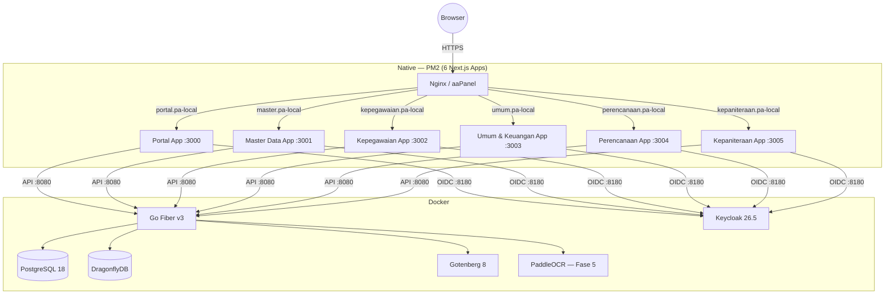

# GAMBARAN APLIKASI — SISTEM INFORMASI KESEKRETARIATAN & KEPANITERAAN

**Referensi:** `blueprint_arch.md` v3.1
**Arsitektur Frontend:** Micro-Frontend — 1 Modul = 1 Aplikasi (Next.js), Backend tetap 1 (Go Fiber)
**Tujuan:** Peta lengkap seluruh aplikasi, modul, halaman, entitas database, dan API per fase.

---

## ARSITEKTUR MICRO-FRONTEND

### Prinsip

```
1 APLIKASI = 1 SUBDOMAIN = 1 NEXT.JS APP = 1 PM2 PROCESS
Backend = 1 Go Fiber Monolith (melayani semua app)
Auth = 1 Keycloak Realm, N Client (1 per app)
Shared = @sikerma/ui + @sikerma/auth + @sikerma/shared (internal packages)
```

> **SIKERMA** = Sistem Informasi Kesekretariatan Mahkamah Agung (nama kerja)

### Daftar Aplikasi

```
┌─────┬───────────────────────────────┬──────────────────────┬───────────┐
│  #  │ Aplikasi                      │ Subdomain            │ Fase      │
├─────┼───────────────────────────────┼──────────────────────┼───────────┤
│  1  │ Portal (Launcher + Dashboard) │ portal.pa-local      │ Fase 1    │
│  2  │ Master Data                   │ master.pa-local      │ Fase 1    │
│  3  │ Kepegawaian & Ortala          │ kepegawaian.pa-local │ Fase 1–2  │
│  4  │ Umum & Keuangan               │ umum.pa-local        │ Fase 3–4  │
│  5  │ Perencanaan, TI & Pelaporan   │ perencanaan.pa-local │ Fase 4    │
│  6  │ Kepaniteraan                  │ kepaniteraan.pa-local│ Fase 5    │
└─────┴───────────────────────────────┴──────────────────────┴───────────┘
```

### Topologi Deployment



### Shared Packages (Monorepo)

```text
/sikerma/                           # Root monorepo
├── packages/
│   ├── ui/                          # @sikerma/ui
│   │   ├── components/              # Shadcn UI + custom components
│   │   │   ├── data-table.tsx       # Tabel universal (sort, search, pagination)
│   │   │   ├── form-dialog.tsx      # Modal form CRUD
│   │   │   ├── page-header.tsx      # Header halaman + action buttons
│   │   │   ├── sidebar.tsx          # Sidebar navigasi (konfigurabel per app)
│   │   │   ├── app-header.tsx       # Topbar (user info, notifikasi, app switcher)
│   │   │   ├── file-upload.tsx      # Upload dengan drag & drop
│   │   │   ├── pdf-preview.tsx      # Preview PDF inline
│   │   │   ├── status-badge.tsx     # Badge status
│   │   │   ├── delete-confirm.tsx   # Dialog konfirmasi hapus
│   │   │   └── breadcrumb.tsx       # Navigasi breadcrumb
│   │   ├── styles/                  # Tailwind config & theme shared
│   │   └── package.json
│   │
│   ├── auth/                        # @sikerma/auth
│   │   ├── better-auth.config.ts    # Config Better Auth + Keycloak OIDC
│   │   ├── middleware.ts            # Auth middleware (protect routes)
│   │   ├── hooks.ts                 # useSession, useUser, useRoles
│   │   └── package.json
│   │
│   └── shared/                      # @sikerma/shared
│       ├── api-client.ts            # HTTP client ke Go backend (fetch wrapper)
│       ├── sse-client.ts            # EventSource wrapper untuk SSE
│       ├── types/                   # TypeScript types shared
│       │   ├── pegawai.ts
│       │   ├── surat.ts
│       │   └── ...
│       ├── utils.ts                 # Formatter tanggal, NIP, dll
│       ├── constants.ts             # Enum, status codes
│       └── package.json
│
├── apps/
│   ├── portal/                      # App 1: Portal
│   ├── master-data/                 # App 2: Master Data
│   ├── kepegawaian/                 # App 3: Kepegawaian & Ortala
│   ├── umum-keuangan/               # App 4: Umum & Keuangan
│   ├── perencanaan/                 # App 5: Perencanaan, TI & Pelaporan
│   └── kepaniteraan/               # App 6: Kepaniteraan
│
├── turbo.json                       # Turborepo config
├── package.json                     # Root workspace
└── pnpm-workspace.yaml             # pnpm workspace config
```

### Model Otorisasi: Hybrid (Keycloak + PostgreSQL)

**Prinsip:** Keycloak hanya tangani **autentikasi (SSO) + akses level app**. Permission detail per modul dikelola di **PostgreSQL** dan bisa diatur admin dari UI Portal.

```
┌──────────────────────────────────────────────────────┐
│  KEYCLOAK — Autentikasi & Akses App                  │
│                                                      │
│  ✓ Login/Logout SSO (1x login untuk semua app)       │
│  ✓ Identity: siapa user ini?                         │
│  ✓ App access: app mana saja yang boleh diakses?     │
│                                                      │
│  Realm: pengadilan-agama                             │
│  Clients: portal, master-data, kepegawaian-ortala,   │
│           umum-keuangan, perencanaan-ti, kepaniteraan │
│  Client Role: hanya 1 → [access]                     │
│                                                      │
│  Token berisi: user_id, name, email, client_access[] │
└──────────────────────────────────┬───────────────────┘
                                   │
                                   ▼
┌──────────────────────────────────────────────────────┐
│  GO BACKEND + POSTGRESQL — Permission Detail         │
│                                                      │
│  ✓ Role per user per app (admin, operator, viewer)   │
│  ✓ Permission per role (module.action)               │
│  ✓ Context: satker, unit kerja                       │
│  ✓ Dikelola admin dari UI Portal                     │
│                                                      │
│  Disimpan di: db_master (tabel RBAC)                 │
│  Dikelola via: Portal > Admin > Hak Akses            │
└──────────────────────────────────────────────────────┘
```

**Tabel RBAC di PostgreSQL (db_master):**

```sql
-- Role per aplikasi
app_roles (
    id UUID PK,
    app_code VARCHAR(50),       -- 'kepegawaian', 'umum-keuangan', dll
    role_code VARCHAR(50),      -- 'admin', 'operator', 'viewer', 'self_service'
    display_name VARCHAR(100),
    description TEXT,
    is_system BOOLEAN DEFAULT false,  -- role bawaan tidak bisa dihapus
    created_at TIMESTAMPTZ
)

-- Daftar permission yang tersedia per app
app_permissions (
    id UUID PK,
    app_code VARCHAR(50),
    module VARCHAR(50),         -- 'pegawai', 'cuti', 'keuangan.anggaran', 'surat'
    action VARCHAR(50),         -- 'view_all', 'view_own', 'create', 'update', 'delete', 'print', 'approve'
    display_name VARCHAR(200),
    description TEXT
)

-- Mapping role → permissions
role_permissions (
    id UUID PK,
    role_id UUID FK → app_roles,
    permission_id UUID FK → app_permissions,
    UNIQUE(role_id, permission_id)
)

-- Mapping user → roles (context-aware)
user_app_roles (
    id UUID PK,
    user_id UUID,              -- dari Keycloak
    role_id UUID FK → app_roles,
    satker_id UUID FK NULL,    -- scope: satker mana (NULL = semua)
    unit_kerja_id UUID FK NULL,-- scope: unit kerja mana (NULL = semua)
    assigned_by UUID,
    assigned_at TIMESTAMPTZ
)
```

**Contoh Data:**

```
app_roles:
│ app_code       │ role_code        │ display_name              │
├────────────────┼──────────────────┼───────────────────────────│
│ kepegawaian    │ admin            │ Admin Kepegawaian         │
│ kepegawaian    │ operator         │ Operator Kepegawaian      │
│ kepegawaian    │ self_service     │ Self-Service Pegawai      │
│ umum-keuangan  │ admin            │ Admin Umum & Keuangan     │
│ umum-keuangan  │ operator_surat   │ Operator Persuratan       │
│ umum-keuangan  │ operator_keuangan│ Operator Keuangan         │
│ umum-keuangan  │ operator_bmn     │ Operator BMN              │

app_permissions:
│ app_code       │ module              │ action    │ display_name                    │
├────────────────┼─────────────────────┼───────────┼─────────────────────────────────│
│ kepegawaian    │ pegawai             │ view_all  │ Lihat semua data pegawai        │
│ kepegawaian    │ pegawai             │ view_own  │ Lihat data diri sendiri         │
│ kepegawaian    │ pegawai             │ create    │ Tambah pegawai baru             │
│ kepegawaian    │ pegawai             │ update    │ Edit data pegawai               │
│ kepegawaian    │ pegawai             │ delete    │ Hapus data pegawai              │
│ kepegawaian    │ cuti                │ approve   │ Approve pengajuan cuti          │
│ umum-keuangan  │ surat               │ create    │ Registrasi surat                │
│ umum-keuangan  │ keuangan.anggaran   │ create    │ Input pagu anggaran             │

user_app_roles (contoh user "Ahmad" — Kasubag Keuangan):
│ user_id │ role                          │ satker          │ unit_kerja │
├─────────┼───────────────────────────────┼─────────────────┼────────────│
│ ahmad   │ umum-keuangan:admin           │ PA Jak-Sel      │ keuangan   │
│ ahmad   │ kepegawaian:self_service      │ PA Jak-Sel      │ NULL       │
│ ahmad   │ perencanaan:viewer            │ PA Jak-Sel      │ NULL       │
```

**Portal Launcher Logic:**
1. User login via Keycloak (SSO — sekali login untuk semua app)
2. Portal baca token → extract `client_access[]` (app mana saja yang boleh)
3. Portal query Go backend → ambil roles + permissions detail dari PostgreSQL
4. Tampilkan card/tile hanya untuk app yang user punya akses
5. Klik tile → redirect ke subdomain app tersebut (sudah authenticated via SSO cookie)
6. Setiap app → query backend untuk permissions detail → render menu/tombol sesuai hak akses

**UI Admin Hak Akses (di Portal app):**
- Halaman `/admin/hak-akses` → admin bisa assign role ke user per app
- Halaman `/admin/hak-akses/roles` → admin bisa buat role baru + mapping permissions
- Perubahan permission **langsung berlaku** tanpa restart Keycloak

---

## IKHTISAR SELURUH FASE & APP

```
FASE 1 ──────────────────────────────────────────────────────────
  [Portal]  ← Launcher + Dashboard ringkasan
  [Master Data]  ← Satker, Jabatan, Golongan, Unit Kerja, Referensi
  [Kepegawaian & Ortala]  ← Data pegawai dasar + Cetak SK

FASE 2 ──────────────────────────────────────────────────────────
  [Kepegawaian & Ortala]  ← Lengkap: Pangkat, Mutasi, Pensiun,
                             Cuti, Absensi, DUK, SKP, Template Mgmt

FASE 3 ──────────────────────────────────────────────────────────
  [Umum & Keuangan]  ← Surat Masuk/Keluar, Disposisi + SSE,
                        Arsip, BMN, SPPD

FASE 4 ──────────────────────────────────────────────────────────
  [Umum & Keuangan]  ← Anggaran, Realisasi, Gaji, Laporan Keuangan
  [Perencanaan, TI & Pelaporan]  ← SAKIP, LKJIP, IKU, Dashboard

FASE 5 ──────────────────────────────────────────────────────────
  [Kepaniteraan]  ← Register Perkara, Jadwal Sidang, Minutasi
  + Aktivasi OCR Engine
  + Integrasi SIKEP/KOMDANAS/SIMARI
```

---

## APP 1: PORTAL (portal.pa-local)

**Fase:** 1 (fondasi, dibangun pertama)
**Fungsi:** Launcher untuk semua app + Dashboard ringkasan lintas modul

### Halaman

| # | Halaman | Route | Deskripsi |
|---|---|---|---|
| 1 | Login | `/login` | Redirect ke Keycloak |
| 2 | Dashboard | `/` | Launcher tiles + widget ringkasan |
| 3 | Profil Saya | `/profil` | Lihat & edit profil user login |
| 4 | Ganti Password | `/profil/password` | Redirect ke Keycloak account console |
| 5 | Admin: User Management | `/admin/users` | Kelola user Keycloak (hanya superadmin) |
| 6 | Admin: Hak Akses | `/admin/hak-akses` | Assign role per user per app |
| 7 | Admin: Kelola Roles | `/admin/hak-akses/roles` | Buat role + mapping permissions |
| 8 | Admin: Audit Log | `/admin/audit-log` | Log audit lintas semua app |

### Dashboard Widgets

| Widget | Data | Sumber |
|---|---|---|
| App Launcher Tiles | Card per app yang bisa diakses user | Keycloak client roles |
| Total Pegawai Aktif | Jumlah per status (PNS/CPNS/PPPK) | API kepegawaian |
| Surat Belum Disposisi | Jumlah surat masuk belum didisposisi | API umum (Fase 3+) |
| Realisasi Anggaran | Progress bar % realisasi vs pagu | API keuangan (Fase 4+) |
| Pegawai Akan Pensiun | List 5 pegawai terdekat BUP | API kepegawaian |
| Aktivitas Terakhir | 10 audit log terbaru | API audit |
| Notifikasi | Daftar notifikasi SSE terbaru | SSE stream (Fase 3+) |

### API yang dipakai Portal

```
GET /api/v1/auth/me                    → Data user login + roles
GET /api/v1/dashboard/summary          → Agregasi data untuk widgets
GET /api/v1/audit-logs                 → List audit logs (paginated)
GET /api/v1/admin/users                → List users Keycloak (proxy)
PUT /api/v1/admin/users/:id/roles      → Assign roles ke user
```

---

## APP 2: MASTER DATA (master.pa-local)

**Fase:** 1 (fondasi)
**Fungsi:** CRUD semua data referensi yang dipakai lintas aplikasi
**Database:** `db_master`

### Halaman

| # | Halaman | Route | Deskripsi |
|---|---|---|---|
| 1 | Dashboard Master | `/` | Ringkasan jumlah data per referensi |
| 2 | Satuan Kerja | `/satker` | CRUD satker |
| 3 | Jabatan | `/jabatan` | CRUD jabatan (struktural & fungsional) |
| 4 | Golongan / Pangkat | `/golongan` | Daftar golongan + nama pangkat |
| 5 | Unit Kerja | `/unit-kerja` | CRUD unit kerja (tree structure) |
| 6 | Eselon | `/eselon` | Daftar level eselon |
| 7 | Pendidikan | `/pendidikan` | Jenjang pendidikan |
| 8 | Agama | `/agama` | Data referensi agama |
| 9 | Status Perkawinan | `/status-kawin` | Data referensi status kawin |
| 10 | Jenis Hukuman Disiplin | `/hukuman-disiplin` | Tingkat hukuman (ringan/sedang/berat) |
| 11 | Jenis Diklat | `/jenis-diklat` | Klasifikasi diklat/pelatihan |

### Entitas Database (db_master)

```sql
satker (
    id UUID PK, kode VARCHAR(20) UNIQUE, nama VARCHAR(200),
    alamat TEXT, telepon VARCHAR(20), email VARCHAR(100),
    tipe [pa/pta/badilum], -- Pengadilan Agama / PTA / Badan
    is_active BOOLEAN DEFAULT true,
    created_at TIMESTAMPTZ, updated_at TIMESTAMPTZ, deleted_at TIMESTAMPTZ
)

jabatan (
    id UUID PK, kode VARCHAR(20) UNIQUE, nama VARCHAR(200),
    jenis [struktural/fungsional_tertentu/fungsional_umum],
    eselon_id UUID FK, kelas_jabatan INT, -- untuk tukin
    is_active BOOLEAN DEFAULT true,
    created_at, updated_at, deleted_at
)

golongan (
    id UUID PK, kode VARCHAR(10) UNIQUE, -- "III/a"
    nama_pangkat VARCHAR(100), -- "Penata Muda"
    ruang VARCHAR(5), tingkat INT,
    created_at, updated_at
)

unit_kerja (
    id UUID PK, satker_id UUID FK, kode VARCHAR(20),
    nama VARCHAR(200), parent_id UUID FK NULL, -- tree/hierarki
    is_active BOOLEAN DEFAULT true,
    created_at, updated_at, deleted_at
)

eselon (
    id UUID PK, kode VARCHAR(10), nama VARCHAR(50),
    level INT, -- 1=tertinggi, 5=terendah
    created_at, updated_at
)

ref_pendidikan (id UUID PK, kode VARCHAR(10), jenjang VARCHAR(50), urutan INT)
ref_agama (id UUID PK, nama VARCHAR(50))
ref_status_kawin (id UUID PK, nama VARCHAR(50))
ref_jenis_hukdis (id UUID PK, tingkat VARCHAR(20), nama VARCHAR(200))
ref_jenis_diklat (id UUID PK, kode VARCHAR(20), nama VARCHAR(200), kategori VARCHAR(50))
```

### API Endpoints

```
Pola seragam untuk SEMUA entitas master:
GET    /api/v1/master/{entity}           → List (paginated, searchable)
GET    /api/v1/master/{entity}/:id       → Detail
POST   /api/v1/master/{entity}           → Create
PUT    /api/v1/master/{entity}/:id       → Update
DELETE /api/v1/master/{entity}/:id       → Soft delete

GET    /api/v1/master/{entity}/dropdown  → Dropdown list (id + nama, tanpa pagination)

{entity} = satker | jabatan | golongan | unit-kerja | eselon |
            pendidikan | agama | status-kawin | hukuman-disiplin | jenis-diklat
```

---

## APP 3: KEPEGAWAIAN & ORTALA (kepegawaian.pa-local)

**Fase:** 1 (dasar) + Fase 2 (lengkap)
**Fungsi:** Pengelolaan data pegawai, karir, kinerja, dan organisasi tata laksana
**Database:** `db_kepegawaian`

### FASE 1 — Modul Dasar

#### Halaman

| # | Halaman | Route | Deskripsi |
|---|---|---|---|
| 1 | Dashboard Kepegawaian | `/` | Statistik pegawai + chart |
| 2 | Daftar Pegawai | `/pegawai` | List + search/filter |
| 3 | Tambah Pegawai | `/pegawai/tambah` | Form multi-step |
| 4 | Detail Pegawai | `/pegawai/[nip]` | Tab: Biodata, Pangkat, Jabatan, Pendidikan, Keluarga |
| 5 | Edit Pegawai | `/pegawai/[nip]/edit` | Edit biodata |
| 6 | Cetak SK | `/cetak-sk` | Pilih template → pegawai → PDF |

#### Entitas Database (db_kepegawaian)

```sql
pegawai (
    id UUID PK, nip VARCHAR(18) UNIQUE, nip_lama VARCHAR(9),
    nama_lengkap VARCHAR(200), gelar_depan VARCHAR(50), gelar_belakang VARCHAR(50),
    tempat_lahir VARCHAR(100), tanggal_lahir DATE,
    jenis_kelamin [L/P], agama_id UUID, status_kawin_id UUID,
    alamat TEXT, telepon VARCHAR(20), email VARCHAR(100),
    foto_path VARCHAR(500),
    -- Posisi saat ini (denormalized untuk query cepat)
    golongan_id UUID, jabatan_id UUID, unit_kerja_id UUID, satker_id UUID,
    tmt_cpns DATE, tmt_pns DATE, tmt_pangkat_terakhir DATE, tmt_jabatan_terakhir DATE,
    status_pegawai [PNS/CPNS/PPPK/Honorer],
    is_active BOOLEAN DEFAULT true,
    created_at, updated_at, deleted_at
)

riwayat_pangkat (
    id UUID PK, pegawai_id UUID FK,
    golongan_id UUID FK,
    no_sk VARCHAR(100), tanggal_sk DATE, tmt_pangkat DATE,
    pejabat_penetap VARCHAR(200),
    jenis [reguler/pilihan/penyesuaian_ijazah/lainnya],
    file_sk_path VARCHAR(500),
    created_at, created_by UUID
)

riwayat_jabatan (
    id UUID PK, pegawai_id UUID FK,
    jabatan_id UUID FK, unit_kerja_id UUID FK,
    no_sk VARCHAR(100), tanggal_sk DATE, tmt_jabatan DATE,
    pejabat_penetap VARCHAR(200),
    file_sk_path VARCHAR(500),
    created_at, created_by UUID
)

riwayat_pendidikan (
    id UUID PK, pegawai_id UUID FK,
    jenjang_id UUID FK,
    nama_sekolah VARCHAR(200), jurusan VARCHAR(200),
    tahun_lulus INT, no_ijazah VARCHAR(100),
    file_ijazah_path VARCHAR(500),
    created_at, created_by UUID
)

keluarga (
    id UUID PK, pegawai_id UUID FK,
    hubungan [suami/istri/anak],
    nama VARCHAR(200), tempat_lahir VARCHAR(100), tanggal_lahir DATE,
    pekerjaan VARCHAR(100), keterangan TEXT,
    created_at, created_by UUID
)
```

#### API Endpoints

```
GET    /api/v1/pegawai                        → List pegawai
GET    /api/v1/pegawai/:nip                   → Detail lengkap
POST   /api/v1/pegawai                        → Tambah pegawai
PUT    /api/v1/pegawai/:nip                   → Update biodata
DELETE /api/v1/pegawai/:nip                   → Nonaktifkan

-- Riwayat (pola sama untuk pangkat/jabatan/pendidikan/keluarga)
GET    /api/v1/pegawai/:nip/{riwayat}         → List riwayat
POST   /api/v1/pegawai/:nip/{riwayat}         → Tambah riwayat
PUT    /api/v1/pegawai/:nip/{riwayat}/:id     → Edit riwayat
DELETE /api/v1/pegawai/:nip/{riwayat}/:id     → Hapus riwayat

POST   /api/v1/pegawai/:nip/foto              → Upload foto

POST   /api/v1/dokumen/cetak                  → Generate dokumen
GET    /api/v1/dokumen/templates              → List template
GET    /api/v1/dokumen/download/:id           → Download file
```

### FASE 2 — Modul Lengkap (ditambahkan ke app yang sama)

#### Halaman Tambahan

| # | Halaman | Route | Deskripsi |
|---|---|---|---|
| 7 | Usulan Kenaikan Pangkat | `/kenaikan-pangkat` | Auto-detect + proses + approval |
| 8 | Mutasi & Promosi | `/mutasi` | Proses mutasi masuk/keluar/internal |
| 9 | Pensiun | `/pensiun` | Daftar BUP + proses pensiun |
| 10 | Pengajuan Cuti | `/cuti` | Ajukan, approval, saldo cuti |
| 11 | Rekap Absensi | `/absensi` | Import + rekap kehadiran |
| 12 | DUK | `/duk` | Daftar Urut Kepangkatan (auto-generated) |
| 13 | SKP / Kinerja | `/skp` | Input target, penilaian, cetak |
| 14 | Diklat / Pelatihan | `/diklat` | Riwayat diklat pegawai |
| 15 | Hukuman Disiplin | `/hukdis` | Riwayat hukuman disiplin |
| 16 | Template Management | `/admin/template` | Upload & kelola template .docx |

#### Entitas Tambahan Fase 2

```sql
usulan_pangkat (
    id UUID PK, pegawai_id UUID FK,
    golongan_asal_id UUID FK, golongan_tujuan_id UUID FK,
    tmt_usulan DATE, periode [April/Oktober],
    status [draft/diusulkan/disetujui/ditolak/selesai],
    catatan TEXT, disetujui_oleh UUID, tanggal_persetujuan DATE,
    no_sk VARCHAR(100), tanggal_sk DATE, file_sk_path VARCHAR(500),
    created_by UUID, created_at, updated_at
)

mutasi (
    id UUID PK, pegawai_id UUID FK,
    jenis [masuk/keluar/internal],
    satker_asal_id UUID, satker_tujuan_id UUID,
    unit_kerja_asal_id UUID, unit_kerja_tujuan_id UUID,
    jabatan_asal_id UUID, jabatan_tujuan_id UUID,
    no_sk VARCHAR(100), tanggal_sk DATE, tmt_mutasi DATE,
    alasan TEXT, status [draft/proses/selesai],
    file_sk_path VARCHAR(500), created_by UUID, created_at
)

pensiun (
    id UUID PK, pegawai_id UUID FK,
    jenis [bup/atas_permintaan/uzur/lain],
    bup_tanggal DATE, tanggal_proses DATE, tanggal_pensiun DATE,
    no_sk VARCHAR(100), tanggal_sk DATE,
    status [belum_proses/dalam_proses/selesai],
    file_sk_path VARCHAR(500), keterangan TEXT,
    created_by UUID, created_at
)

cuti (
    id UUID PK, pegawai_id UUID FK,
    jenis [tahunan/sakit/besar/melahirkan/alasan_penting/diluar_tanggungan],
    tanggal_mulai DATE, tanggal_selesai DATE, jumlah_hari INT,
    alasan TEXT, alamat_selama_cuti TEXT,
    status [draft/diajukan/disetujui_atasan/disetujui_final/ditolak/batal],
    disetujui_oleh UUID, tanggal_persetujuan DATE,
    file_pendukung_path VARCHAR(500),
    created_at
)

saldo_cuti (
    id UUID PK, pegawai_id UUID FK, tahun INT,
    jatah_tahunan INT DEFAULT 12, terpakai INT DEFAULT 0, sisa INT,
    cuti_besar_terakhir DATE
)

absensi (
    id UUID PK, pegawai_id UUID FK, tanggal DATE,
    jam_masuk TIME, jam_pulang TIME,
    status [hadir/izin/sakit/cuti/dinas_luar/alpha],
    keterangan TEXT, sumber [manual/import_mesin]
)

skp (
    id UUID PK, pegawai_id UUID FK,
    penilai_id UUID FK, atasan_penilai_id UUID FK,
    tahun INT, periode [Januari-Juni/Juli-Desember],
    status [draft/dinilai/final],
    nilai_total DECIMAL, predikat [sangat_baik/baik/cukup/kurang/buruk],
    created_at
)

skp_target (
    id UUID PK, skp_id UUID FK,
    uraian_kegiatan TEXT,
    target_kuantitas DECIMAL, target_kualitas DECIMAL, target_waktu INT,
    realisasi_kuantitas DECIMAL, realisasi_kualitas DECIMAL, realisasi_waktu INT,
    nilai DECIMAL, keterangan TEXT
)

skp_perilaku (
    id UUID PK, skp_id UUID FK,
    aspek [orientasi_pelayanan/komitmen/inisiatif_kerja/kerjasama/kepemimpinan],
    nilai DECIMAL, keterangan TEXT
)

riwayat_diklat (
    id UUID PK, pegawai_id UUID FK,
    jenis_diklat_id UUID FK,
    nama_diklat VARCHAR(200), penyelenggara VARCHAR(200),
    tanggal_mulai DATE, tanggal_selesai DATE, jam_pelajaran INT,
    no_sertifikat VARCHAR(100), file_sertifikat_path VARCHAR(500),
    created_at, created_by UUID
)

hukuman_disiplin (
    id UUID PK, pegawai_id UUID FK,
    jenis_hukdis_id UUID FK,
    no_sk VARCHAR(100), tanggal_sk DATE,
    tmt_hukuman DATE, masa_berlaku_bulan INT,
    alasan TEXT, file_sk_path VARCHAR(500),
    status [aktif/selesai/dicabut],
    created_at, created_by UUID
)

template_dokumen (
    id UUID PK, nama VARCHAR(200),
    kategori [sk/surat_tugas/nota_dinas/sppd/lainnya],
    deskripsi TEXT, file_path VARCHAR(500),
    placeholders JSONB,
    is_active BOOLEAN DEFAULT true, version INT DEFAULT 1,
    created_by UUID, created_at, updated_at
)
```

---

## APP 4: UMUM & KEUANGAN (umum.pa-local)

**Fase:** 3 (Umum) + Fase 4 (Keuangan)
**Fungsi:** Persuratan, disposisi, BMN, SPPD, anggaran, realisasi, gaji
**Database:** `db_umum` (persuratan, BMN, SPPD) + `db_keuangan` (anggaran, gaji)

### FASE 3 — Modul Umum

#### Halaman

| # | Halaman | Route | Deskripsi |
|---|---|---|---|
| 1 | Dashboard Umum | `/` | Ringkasan surat, BMN, SPPD |
| 2 | Surat Masuk | `/surat/masuk` | List + registrasi surat masuk |
| 3 | Registrasi Surat Masuk | `/surat/masuk/registrasi` | Form input + upload scan |
| 4 | Detail Surat Masuk | `/surat/masuk/[id]` | Detail + tracking disposisi |
| 5 | Surat Keluar | `/surat/keluar` | List surat keluar |
| 6 | Buat Surat Keluar | `/surat/keluar/buat` | Template → generate |
| 7 | Detail Surat Keluar | `/surat/keluar/[id]` | Detail + tracking |
| 8 | Disposisi | `/disposisi` | List disposisi untuk user login |
| 9 | Buat Disposisi | `/disposisi/buat` | Form disposisi |
| 10 | Tracking Disposisi | `/disposisi/tracking/[surat_id]` | Tree view alur disposisi |
| 11 | Buku Agenda | `/surat/agenda` | Cetak agenda masuk/keluar |
| 12 | Arsip | `/arsip` | List + search arsip digital |
| 13 | Daftar BMN | `/bmn` | List inventaris BMN |
| 14 | Input BMN | `/bmn/input` | Tambah barang |
| 15 | Detail BMN | `/bmn/[id]` | Detail + riwayat |
| 16 | Mutasi BMN | `/bmn/mutasi` | Pindah antar ruangan |
| 17 | Laporan BMN | `/bmn/laporan` | Export SIMAK BMN |
| 18 | Daftar SPPD | `/sppd` | List SPPD |
| 19 | Buat SPPD | `/sppd/buat` | Form + auto-generate nomor |
| 20 | Cetak SPPD | `/sppd/[id]/cetak` | Generate SPPD → PDF |

#### Entitas Database (db_umum)

```sql
surat_masuk (
    id UUID PK, nomor_agenda VARCHAR(50), nomor_surat VARCHAR(100),
    tanggal_surat DATE, tanggal_terima DATE,
    asal_surat VARCHAR(200), perihal TEXT,
    sifat [biasa/segera/sangat_segera/rahasia],
    klasifikasi VARCHAR(50), lampiran_jumlah INT, lampiran_jenis VARCHAR(100),
    file_scan_path VARCHAR(500),
    penerima_awal_id UUID, status [diterima/didisposisi/selesai/arsip],
    created_by UUID, created_at
)

surat_keluar (
    id UUID PK, nomor_surat VARCHAR(100),
    tanggal_surat DATE, tujuan VARCHAR(200), perihal TEXT,
    sifat VARCHAR(20), klasifikasi VARCHAR(50),
    isi_ringkas TEXT, template_id UUID FK NULL,
    file_path VARCHAR(500), penandatangan_id UUID,
    status [draft/review/ditandatangani/terkirim],
    created_by UUID, created_at
)

nomor_surat_counter (
    id UUID PK, satker_id UUID FK,
    klasifikasi VARCHAR(50), tahun INT, bulan INT,
    counter INT DEFAULT 0
)

disposisi (
    id UUID PK, surat_masuk_id UUID FK,
    dari_id UUID, kepada_id UUID,
    instruksi TEXT, sifat [biasa/segera/sangat_segera],
    batas_waktu DATE,
    status [belum_dibaca/dibaca/dikerjakan/selesai],
    tanggal_baca TIMESTAMPTZ, tanggal_selesai TIMESTAMPTZ,
    catatan_tindak_lanjut TEXT,
    parent_disposisi_id UUID FK NULL,
    created_at
)

arsip (
    id UUID PK, kode_klasifikasi VARCHAR(50), nomor_arsip VARCHAR(100),
    judul VARCHAR(500), deskripsi TEXT, tahun INT,
    jenis [surat_masuk/surat_keluar/sk/laporan/lainnya],
    source_id UUID, source_type VARCHAR(50),
    lokasi_fisik VARCHAR(200), file_digital_path VARCHAR(500),
    retensi_aktif_tahun INT, retensi_inaktif_tahun INT,
    tanggal_arsip DATE, tanggal_musnahkan DATE NULL,
    status [aktif/inaktif/musnah],
    created_by UUID, created_at
)

bmn (
    id UUID PK, kode_barang VARCHAR(50), nup INT,
    nama_barang VARCHAR(200), merk VARCHAR(100), tipe VARCHAR(100),
    tahun_perolehan INT, nilai_perolehan DECIMAL(15,2),
    kondisi [baik/rusak_ringan/rusak_berat],
    lokasi_ruangan VARCHAR(200), unit_kerja_id UUID FK,
    penanggung_jawab_id UUID,
    status [aktif/dihapus/dipindahkan],
    created_at, updated_at
)

bmn_mutasi (
    id UUID PK, bmn_id UUID FK,
    dari_unit_id UUID, ke_unit_id UUID,
    dari_ruangan VARCHAR(200), ke_ruangan VARCHAR(200),
    tanggal_mutasi DATE, keterangan TEXT,
    created_by UUID
)

sppd (
    id UUID PK, nomor_sppd VARCHAR(100),
    pegawai_id UUID, tujuan VARCHAR(200), lokasi_tujuan VARCHAR(200),
    tanggal_berangkat DATE, tanggal_kembali DATE,
    maksud_perjalanan TEXT, tingkat_biaya [tinggi/sedang/rendah],
    sumber_dana VARCHAR(100), pejabat_pemberi_perintah_id UUID,
    status [draft/disetujui/selesai/dibatalkan],
    file_sppd_path VARCHAR(500),
    created_by UUID, created_at
)

sppd_visum (
    id UUID PK, sppd_id UUID FK,
    tempat VARCHAR(200), tanggal DATE,
    pejabat_nama VARCHAR(200), keterangan TEXT
)
```

#### SSE Events (aktif di Fase 3)

```
disposisi:baru          → Notif ke pegawai tujuan
disposisi:dibaca        → Notif ke pengirim
disposisi:selesai       → Notif ke pengirim
surat_masuk:baru        → Notif ke unit TU
sppd:disetujui          → Notif ke pegawai terkait
```

### FASE 4 — Modul Keuangan (ditambahkan ke app yang sama)

#### Halaman Tambahan

| # | Halaman | Route | Deskripsi |
|---|---|---|---|
| 21 | Dashboard Keuangan | `/keuangan` | Realisasi vs pagu chart |
| 22 | DIPA / Pagu Anggaran | `/keuangan/anggaran` | Input pagu per MAK |
| 23 | Detail Anggaran | `/keuangan/anggaran/[id]` | Breakdown detail |
| 24 | Revisi Anggaran | `/keuangan/anggaran/revisi` | Catat revisi DIPA |
| 25 | Input Realisasi | `/keuangan/realisasi` | Catat realisasi per akun |
| 26 | Monitoring Realisasi | `/keuangan/realisasi/monitoring` | Dashboard realisasi |
| 27 | Laporan Keuangan | `/keuangan/laporan` | Export Excel (SAIBA) |
| 28 | Rekap Gaji | `/keuangan/gaji` | Rekap gaji bulanan |
| 29 | Import Gaji | `/keuangan/gaji/import` | Import CSV dari GPP |
| 30 | Slip Gaji | `/keuangan/gaji/slip/[pegawai_id]` | Cetak slip gaji |
| 31 | Tunjangan Kinerja | `/keuangan/tukin` | Rekap tukin |
| 32 | Rekap Pajak | `/keuangan/pajak` | PPh 21 per pegawai |

#### Entitas Database (db_keuangan)

```sql
anggaran (
    id UUID PK, tahun INT, satker_id UUID,
    nomor_dipa VARCHAR(100), tanggal_dipa DATE,
    total_pagu DECIMAL(15,2),
    status [aktif/revisi],
    created_at
)

anggaran_detail (
    id UUID PK, anggaran_id UUID FK,
    program_kode VARCHAR(20), program_nama VARCHAR(200),
    kegiatan_kode VARCHAR(20), kegiatan_nama VARCHAR(200),
    output_kode VARCHAR(20), output_nama VARCHAR(200),
    komponen_kode VARCHAR(20), komponen_nama VARCHAR(200),
    akun_kode VARCHAR(20), akun_nama VARCHAR(200),
    pagu DECIMAL(15,2),
    created_at
)

anggaran_revisi (
    id UUID PK, anggaran_detail_id UUID FK,
    pagu_semula DECIMAL(15,2), pagu_menjadi DECIMAL(15,2),
    nomor_revisi VARCHAR(50), tanggal_revisi DATE,
    keterangan TEXT, created_at
)

realisasi (
    id UUID PK, anggaran_detail_id UUID FK,
    tanggal_realisasi DATE,
    nomor_spm VARCHAR(100), tanggal_spm DATE,
    nomor_sp2d VARCHAR(100), tanggal_sp2d DATE,
    jumlah DECIMAL(15,2), uraian TEXT,
    bukti_path VARCHAR(500),
    created_by UUID, created_at
)

gaji (
    id UUID PK, pegawai_id UUID, bulan INT, tahun INT,
    gaji_pokok DECIMAL(12,2), tunjangan_suami_istri DECIMAL(12,2),
    tunjangan_anak DECIMAL(12,2), tunjangan_jabatan DECIMAL(12,2),
    tunjangan_beras DECIMAL(12,2), tunjangan_lain DECIMAL(12,2),
    potongan_pph DECIMAL(12,2), potongan_iuran DECIMAL(12,2),
    potongan_lain DECIMAL(12,2),
    total_bruto DECIMAL(12,2), total_potongan DECIMAL(12,2),
    take_home_pay DECIMAL(12,2),
    sumber [import_gpp/manual],
    created_at
)

tunjangan_kinerja (
    id UUID PK, pegawai_id UUID, bulan INT, tahun INT,
    grade INT, jumlah DECIMAL(12,2),
    potongan_absensi DECIMAL(12,2), potongan_hukuman DECIMAL(12,2),
    netto DECIMAL(12,2), created_at
)
```

---

## APP 5: PERENCANAAN, TI & PELAPORAN (perencanaan.pa-local)

**Fase:** 4
**Fungsi:** SAKIP, LKJIP, IKU, monitoring kinerja, dashboard eksekutif
**Database:** `db_perencanaan` (baru)

### Halaman

| # | Halaman | Route | Deskripsi |
|---|---|---|---|
| 1 | Dashboard Kinerja | `/` | Dashboard visual capaian IKU + realisasi |
| 2 | Renstra | `/renstra` | Rencana Strategis 5 tahunan |
| 3 | Renja / RKT | `/renja` | Rencana Kerja Tahunan |
| 4 | IKU | `/iku` | Indikator Kinerja Utama |
| 5 | Perjanjian Kinerja | `/pk` | PK tahunan per pejabat |
| 6 | Monitoring Kinerja | `/monitoring` | Capaian triwulanan + bukti dukung |
| 7 | LKJIP | `/lkjip` | Laporan Kinerja tahunan |
| 8 | Laporan Statistik | `/laporan` | Laporan lintas modul (Excel/PDF) |

### Entitas Database (db_perencanaan)

```sql
iku (
    id UUID PK, satker_id UUID, tahun INT,
    sasaran_strategis TEXT, indikator TEXT,
    target_nilai DECIMAL, satuan VARCHAR(50),
    created_at
)

capaian_kinerja (
    id UUID PK, iku_id UUID FK, triwulan INT,
    realisasi_nilai DECIMAL, keterangan TEXT,
    bukti_path VARCHAR(500),
    created_by UUID, created_at
)

perjanjian_kinerja (
    id UUID PK, satker_id UUID, tahun INT,
    pejabat_id UUID, atasan_id UUID,
    status [draft/ditandatangani],
    file_path VARCHAR(500), created_at
)

renstra (
    id UUID PK, satker_id UUID,
    tahun_mulai INT, tahun_selesai INT,
    visi TEXT, misi JSONB, tujuan JSONB,
    file_path VARCHAR(500), created_at
)

renja (
    id UUID PK, satker_id UUID, tahun INT,
    program JSONB, kegiatan JSONB,
    file_path VARCHAR(500), created_at
)
```

---

## APP 6: KEPANITERAAN (kepaniteraan.pa-local)

**Fase:** 5
**Fungsi:** Administrasi pendukung perkara + OCR + integrasi sistem MA
**Database:** `db_kepaniteraan` (baru)

### Halaman

| # | Halaman | Route | Deskripsi |
|---|---|---|---|
| 1 | Dashboard Kepaniteraan | `/` | Statistik perkara |
| 2 | Register Perkara | `/register` | List register perkara |
| 3 | Input Register | `/register/input` | Input data register |
| 4 | Jadwal Sidang | `/jadwal-sidang` | Kalender sidang per majelis |
| 5 | Minutasi | `/minutasi` | Checklist kelengkapan berkas |
| 6 | Laporan Perkara | `/laporan` | Statistik perkara (Excel/PDF) |
| 7 | OCR Scanner | `/tools/ocr` | Upload → extract teks |
| 8 | Hasil OCR | `/tools/ocr/hasil/[id]` | Review & koreksi |
| 9 | Integrasi SIKEP | `/admin/integrasi/sikep` | Sync data pegawai |
| 10 | Integrasi KOMDANAS | `/admin/integrasi/komdanas` | Sync data diklat |
| 11 | Log Integrasi | `/admin/integrasi/log` | Log request/response |

### Entitas Database (db_kepaniteraan)

```sql
register_perkara (
    id UUID PK, nomor_perkara VARCHAR(100),
    jenis_perkara [gugatan/permohonan],
    kategori [cerai_gugat/cerai_talak/isbat_nikah/waris/lainnya],
    tanggal_register DATE, tanggal_putus DATE NULL,
    majelis_hakim JSONB, panitera_pengganti_id UUID,
    status [register/proses/putus/minutasi/arsip],
    created_at
)

jadwal_sidang (
    id UUID PK, perkara_id UUID FK, sidang_ke INT,
    tanggal_sidang DATE, jam_sidang TIME,
    ruang_sidang VARCHAR(50), agenda TEXT,
    status [dijadwalkan/dilaksanakan/ditunda/batal],
    catatan TEXT, created_at
)

minutasi (
    id UUID PK, perkara_id UUID FK,
    checklist JSONB,
    status [belum_lengkap/lengkap/dikirim_pta],
    tanggal_selesai DATE NULL, created_at
)
```

---

## CROSS-CUTTING: AUDIT TRAIL (db_master)

Tabel audit_logs ada di `db_master`, digunakan oleh semua app:

```sql
audit_logs (
    id UUID PK,
    app_source VARCHAR(50),        -- portal/master/kepegawaian/umum/perencanaan/kepaniteraan
    user_id UUID NOT NULL,
    user_name VARCHAR(100),
    action VARCHAR(50),
    resource_type VARCHAR(50),
    resource_id VARCHAR(100),
    old_value JSONB,
    new_value JSONB,
    ip_address INET,
    user_agent TEXT,
    created_at TIMESTAMPTZ DEFAULT NOW()
)
```

---

## TOTAL RINGKASAN

| App | Subdomain | Fase | Halaman | Tabel DB | Database |
|---|---|---|---|---|---|
| Portal | portal.pa-local | 1 | 8 | 5 (audit + RBAC) | db_master |
| Master Data | master.pa-local | 1 | 11 | 10 | db_master |
| Kepegawaian & Ortala | kepegawaian.pa-local | 1–2 | 16 | 15 | db_kepegawaian |
| Umum & Keuangan | umum.pa-local | 3–4 | 32 | 15 | db_umum + db_keuangan |
| Perencanaan, TI & Pelaporan | perencanaan.pa-local | 4 | 8 | 5 | db_perencanaan |
| Kepaniteraan | kepaniteraan.pa-local | 5 | 11 | 3 | db_kepaniteraan |
| **TOTAL** | | | **86** | **53** | **6 database** |

Shared Packages: `@sikerma/ui`, `@sikerma/auth`, `@sikerma/shared`
Backend: 1 Go Fiber v3 monolith (~170 API endpoints)
Monorepo: Turborepo + pnpm workspace

---

## LANGKAH SELANJUTNYA

Gambaran lengkap sudah selesai. Selanjutnya diskusi **per FASE, per MODUL:**

1. Validasi modul per app — apakah pembagian sudah sesuai kebutuhan PA?
2. Detail logika bisnis tiap sub-modul
3. Prioritas sub-modul dalam setiap fase
4. Mulai implementasi Fase 1
